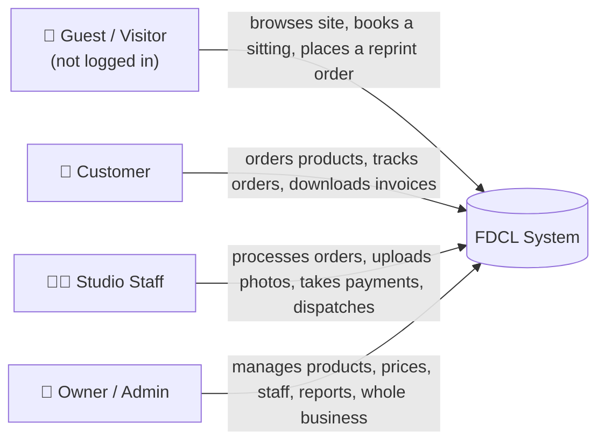
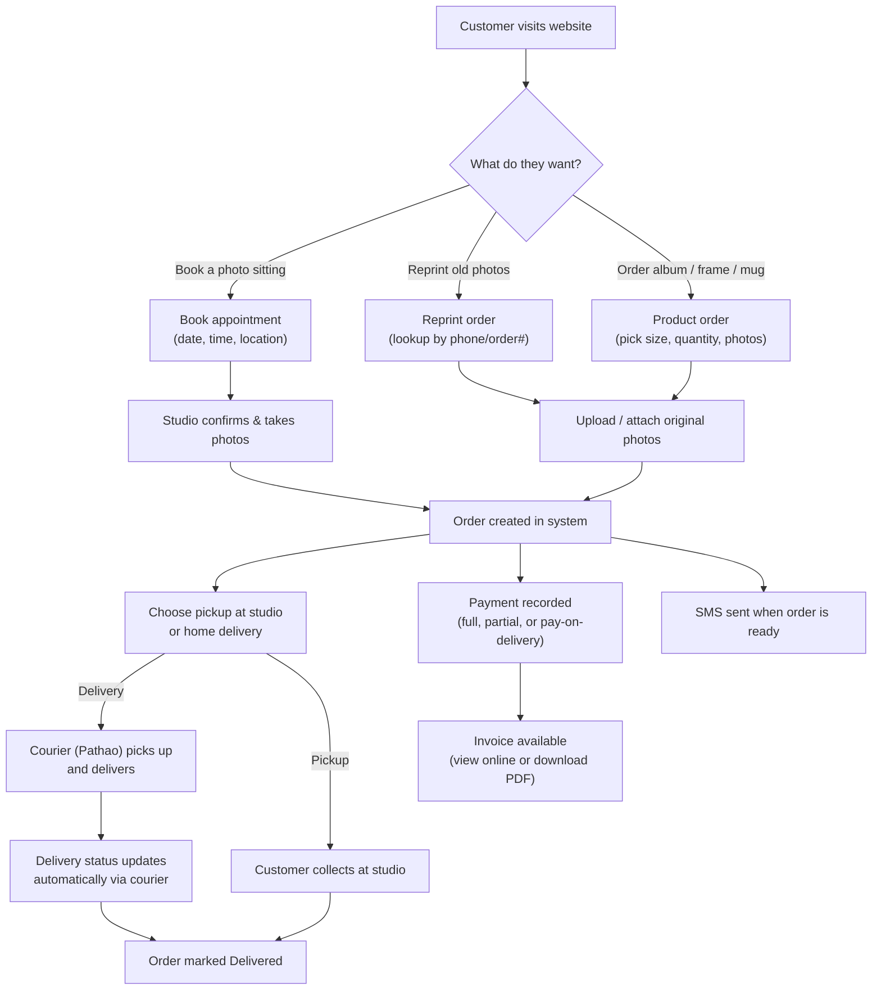
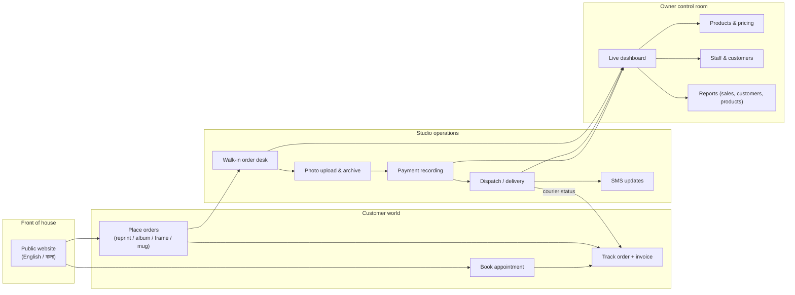

# FDCL — Feature Audit Report

**Focus Digital Color Lab** photo studio order system, Dhaka.
Plain-English guide to what the system does and who it helps. No tech jargon.

---

## 1. What is this, in one sentence?

FDCL is the online system a photo studio uses to run its whole business: customers book
photo sessions or order prints/albums/frames/mugs online, staff process and fulfil those
orders in-store, and the owner watches sales, payments, and performance from one dashboard.

Think of it as three things bolted together:

- A **shopfront** where customers order photo products and book sittings
- A **workbench** where staff turn those orders into finished, delivered products
- A **control room** where the owner sees money in, money out, and what's selling

---

## 2. Who uses it

Four types of people use the system, each with their own view — nobody sees more than
their role allows.

| Role              | Who they are                                | What they can do                                                                                                                                                                                        |
| ----------------- | ------------------------------------------- | ------------------------------------------------------------------------------------------------------------------------------------------------------------------------------------------------------- |
| **Guest**         | Someone visiting the website, not signed in | Browse the site, see photo/album/frame/mug catalogues, book a photo-studio appointment, place a reprint order                                                                                           |
| **Customer**      | A registered client                         | Everything a guest can, plus: place full orders (album, frame, mug), track order status, view/download invoices, manage their profile                                                                   |
| **Staff**         | Studio front-desk / lab employee            | Create walk-in orders, look up customers, upload customer photos, record payments, send SMS updates, mark orders as dispatched, manage appointments, browse the photo archive                           |
| **Owner / Admin** | The business owner or manager               | Everything staff can, plus: manage the product catalogue and prices, manage staff/user accounts, set studio fees per location, run sales/appointment/customer/product reports, watch the live dashboard |

---

## 3. The customer journey, start to finish

---

## 4. Full feature list

### 4.1 Ordering & booking (customer-facing)

- **Appointment booking** — pick a studio location, date and time for a photo sitting
- **Reprint orders** — reorder prints from a past visit by looking up an old order or phone number, no need to re-upload photos
- **Album orders** — custom photo albums, upload the photos, choose size/quantity
- **Frame orders** — framed prints in various sizes
- **Mug orders** — photo-printed mugs
- **Pickup or home delivery** — customer chooses to collect in-store or have it delivered
- **Courier delivery via Pathao** — regular or express delivery, with live status updates fed automatically back into the order (out for delivery, delivered, cancelled, etc.)
- **Multiple studio locations** — orders and appointments are tied to a specific branch

### 4.2 Customer account

- **Registration & login** — email/password, or one-click Google sign-in
- **Phone verification (OTP)** — a 6-digit code sent by SMS confirms a customer's phone number
- **Password reset by OTP** — forgot password flow also works over SMS, not just email
- **Customer dashboard** — a list of the customer's own orders and their live status
- **Order detail & tracking** — see items, payment status, and delivery status per order
- **Invoices** — downloadable PDF invoice for any order; a shareable public link also works without logging in (useful for sending to someone else)
- **Profile management** — update contact details, change phone number (with OTP re-verification), delete account

### 4.3 In-studio operations (staff-facing)

- **Walk-in order creation** — staff can create an order on the spot for a customer standing at the counter
- **Customer lookup/search** — quickly find an existing customer by name or phone while at the counter
- **Photo upload & photo registry** — staff attach the customer's photos to an order; photos are also kept in a reusable "registry" so a customer's photos can be pulled up again later for reprints without re-uploading
- **Photo archive browser** — staff can browse and download previously stored customer photos by code
- **Payment recording** — record cash/bkash/card payments against an order, track partial payments and balances owed
- **Order dispatch** — mark an order as sent out (triggers courier handoff for deliveries)
- **SMS notifications** — send "your invoice is ready" or "your order is ready for pickup" texts directly to the customer's phone
- **Appointment management** — staff see the day's/week's booked sittings and update their status (attended, no-show, etc.)

### 4.4 Business management (owner-facing)

- **Live dashboard** — today's orders, today's revenue, pending orders, unpaid balances, this-month vs last-month revenue comparison, new customers this month, overdue unpaid orders, appointment attendance rate — all at a glance, filterable by date range and by studio location
- **Product & pricing catalogue** — add/edit/reorder/deactivate products (prints, albums, frames, mugs), set sizes and prices per item
- **Studio fee management** — set the photo-sitting fee per location, and switch it on/off
- **Staff & user management** — create staff accounts, view any user's order history, reset a customer's password, enable online-ordering access for a walk-in-only customer
- **Reporting** — generate sales, appointments, customers, or product-performance reports for any date range and location, export as PDF or CSV
- **SMS credit balance check** — see remaining SMS credit so the studio never runs out of notification texts mid-month

### 4.5 Behind the scenes (what makes it reliable)

- **Automatic delivery status sync** — the courier partner (Pathao) pushes delivery updates straight into the system, so staff never have to manually chase "where's my parcel"
- **Secure, size-checked photo storage** — only real image files are accepted, and photos are organised by order so nothing gets mixed up between customers
- **Role-based access** — a staff member can never see admin-only screens, and a customer can never see another customer's order
- **Bilingual site** — the public-facing website supports English and Bangla

---

## 5. How this helps the owner

| Pain without a system                                              | What FDCL gives instead                                                               |
| ------------------------------------------------------------------ | ------------------------------------------------------------------------------------- |
| No visibility into daily sales until end-of-month bookkeeping      | Live dashboard shows today's revenue, pending work, and unpaid balances in real time  |
| Hard to know which branch is underperforming                       | Every number can be filtered per studio location                                      |
| Price changes require reprinting menus or retraining staff         | Prices and products are edited once, centrally, and update everywhere instantly       |
| Chasing customers for unpaid balances is manual and easy to forget | Overdue-unpaid orders are flagged automatically on the dashboard                      |
| No record of who took which payment                                | Every payment is logged against a staff member and an order                           |
| Customers calling to ask "where's my order"                        | Customers can check order status themselves, and courier updates arrive automatically |
| Reports for accounting/tax time take hours to compile by hand      | One-click sales/customer/product/appointment reports, exportable as PDF or CSV        |

**Bottom line:** the owner gets a real-time, accurate picture of the business without
having to physically be at every counter, every day.

## 6. How this helps customers

| Old way                                           | With FDCL                                                                                                |
| ------------------------------------------------- | -------------------------------------------------------------------------------------------------------- |
| Call or visit the studio to book a sitting        | Book online any time, from any device                                                                    |
| Bring photos to the studio in person for reprints | Photos are kept on Cloud — order a reprint by Photo ID, no re-upload needed                              |
| No way to know if an order is ready               | Get an SMS the moment it's ready, or check status online                                                 |
| Lose a paper receipt, lose the invoice            | Invoice is always available online, and can be shared as a link even to people who don't have an account |
| Must pick up in person                            | Choose home delivery instead, with tracked courier status                                                |
| Re-enter details every visit                      | A saved account remembers contact info and address for next time                                         |

**Bottom line:** ordering photos becomes as easy as any modern online shop, while
keeping the option to walk in and deal with a real person at the counter.

---

## 7. At a glance — the whole system

---

## 8. Summary

FDCL replaces phone calls, paper order slips, and manual bookkeeping with one connected
system that covers the entire order lifecycle — from a customer booking a sitting online,
through staff fulfilling it in-studio, to the owner seeing the revenue land on a dashboard.
Every role (guest, customer, staff, owner) gets exactly the view and tools they need, and
nothing they don't.
